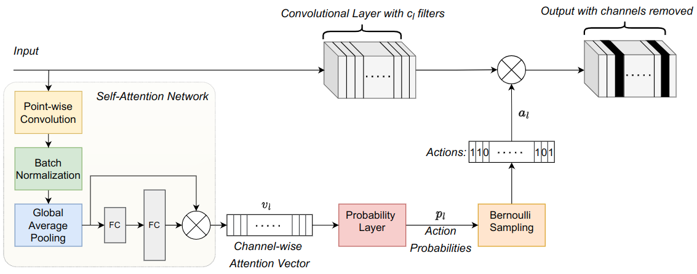

# Dynamos

This is the official repository of VISAPP 2023 paper "[Dynamically Modular and Sparse General Continual Learning](https://arxiv.org/abs/2301.00620)" by [Arnav Varma](https://scholar.google.com/citations?user=3QSih2AAAAAJ&hl=en&oi=ao), [Elahe Arani](https://www.linkedin.com/in/elahe-arani-630870b2/), [Bahram Zonooz](https://scholar.google.com/citations?hl=en&user=FZmIlY8AAAAJ).  
The repo is based on the [Mammoth](https://github.com/aimagelab/mammoth) framework.

###  Schematic of ___Dynamos___


## Setup

+ Use requirements.txt to set up environment.
+ Use main_policy.py to run experiments.
+ Datasets are assumed to be accessible from a parent directory in the format `/path/to/datasets/{dataset name}`
+ Sample commands:
```
python main_policy.py --model dynamos --dataset {name of dataset} --tensorboard --data-path {/path/to/dataset/} --save-path {/path/to/output/directory} --csv_log --exp-name {name of exp} --buffer_size 500 --seed 42 --load_best_args
```
```
python main_policy.py --model dynamos --dataset {name of dataset} --tensorboard --data-path {/path/to/dataset/} --save-path {/path/to/output/directory} --csv_log --exp-name {name of exp} --buffer_size 500 --seed 42 --n_epochs 1 --batch_size 10 --lr 0.07 --alpha 0.2 --beta 2.0 --minibatch_size 10 --nf 32 --policy-alpha 0.2 --prototype-loss 0.3 --policy-penalty -500 --reward-weight 0.5 --keep-ratio 0.7
```

## Cite Our Work

If you find the code useful in your research, please consider citing our paper:

<pre>
@conference{visapp23,
author={Arnav Varma. and Elahe Arani. and Bahram Zonooz.},
title={Dynamically Modular and Sparse General Continual Learning},
booktitle={Proceedings of the 18th International Joint Conference on Computer Vision, Imaging and Computer Graphics Theory and Applications - Volume 5: VISAPP,},
year={2023},
pages={262-273},
publisher={SciTePress},
organization={INSTICC},
doi={10.5220/0011790200003417},
isbn={978-989-758-634-7},
issn={2184-4321},
}
</pre>

## License

This project is licensed under the terms of the MIT license.
